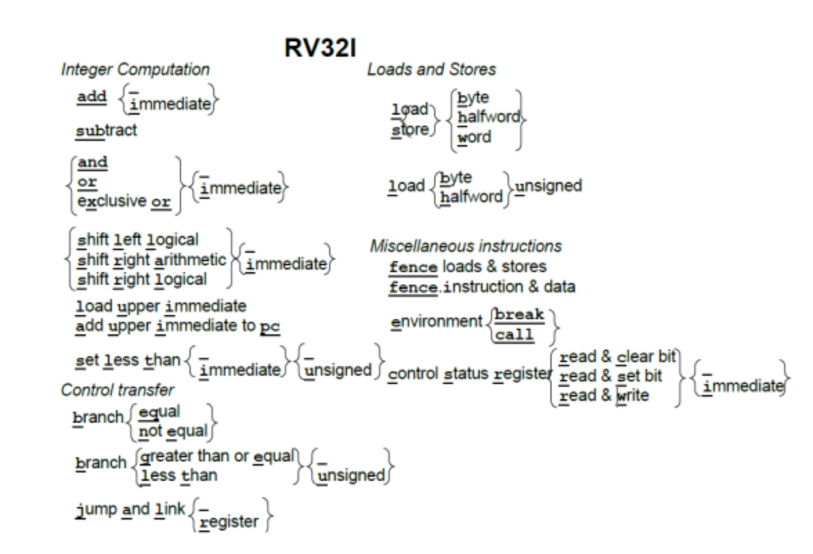
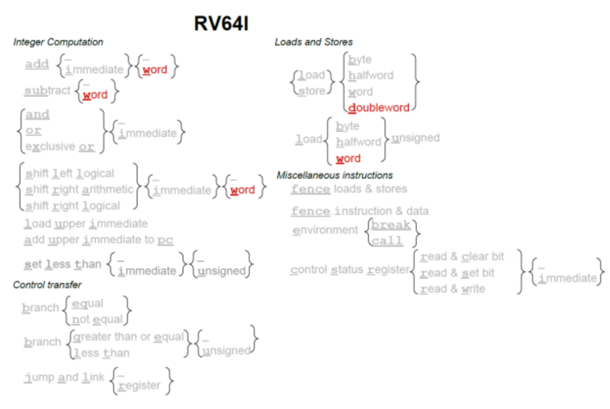
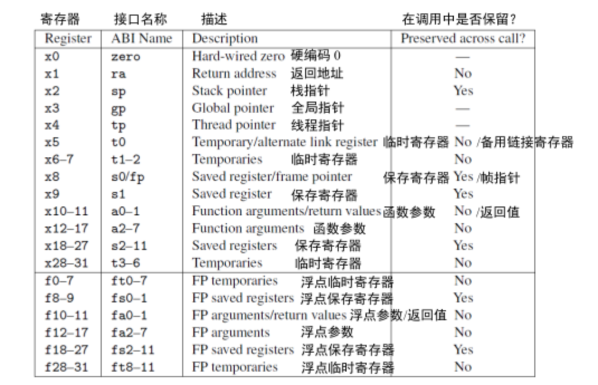
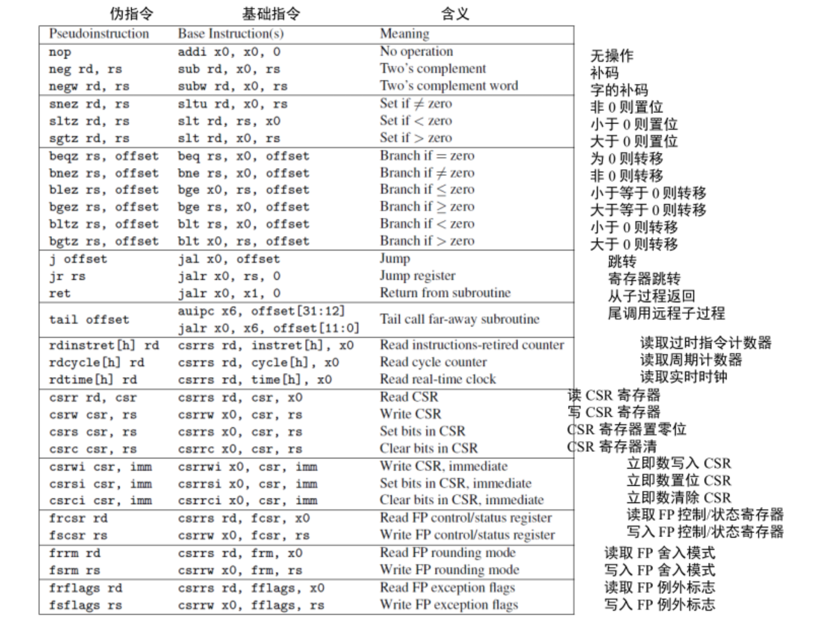
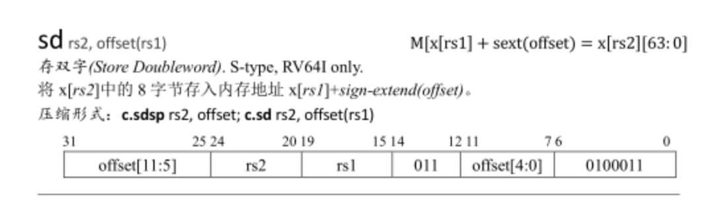

# Table of Contents

1.  [预习](#orgfa80514)
2.  [rCore每日学习记录](#org7fefbdb)
    1.  [2023-10-21](#org9d1b083)
        1.  [2.7.2边界检查的简单方法](#org0a3558e)
    2.  [2023-10-22](#org6ccf587)
        1.  [这里可以反复回来看看](#org157b62b)
        2.  [编译qemu-7.0.0失败](#org053d663)
    3.  [2023-10-23](#orgf93e7ba)
        1.  [代码提示](#org57c136c)
    4.  [2023-10-24](#org29b532f)
    5.  [2023-10-25](#org62e77e9)
    6.  [2023-10-26](#org5977f6d)
        1.  [指令](#org223ea7d)
        2.  [寄存器](#org8172cbb)
        3.  [伪指令](#org82994e4)
    7.  [&lt;2023-10-27 Fri&gt;](#org2ff0012)

每日记录展示地址
<https://github.com/LearningOS/rust-based-os-comp2023/issues/1>

<https://github.com/LearningOS/rust-based-os-comp2023/blob/main/scheduling-2.md>

<https://github.com/LearningOS/2023s-rcore-zrubing>
<https://github.com/LearningOS/2023a-rcore-zrubing>

# 预习

<https://learningos.cn/rCore-Tutorial-Guide-2023A>

# rCore每日学习记录

硬件软件接口RISC-V版

## 2023-10-21

学习了risk-v的，R型指令，I型指令与S型指令，S型还不是很理解

学习逻辑指令，决策指令

计算机过程

寄存器

嵌套过程

### TODO 2.7.2边界检查的简单方法

为啥将有符号数当成无符号数，可以低成本检查是否 0<=x<y

## 2023-10-22

jal x1,A 是什么来着，忘了
回顾一下，jal x1，A 代表跳转A的同时，将下一条指令的地址保存到寄存器 x1

### TODO 这里可以反复回来看看

2030-10-26，回看了下RISC-V，jal是 jump and link [register]

### 编译qemu-7.0.0失败

下面可以解决，不知道对不对
<https://patchew.org/QEMU/20220527190658.169439-1-i@hexchain.org/>

完成第零章，环境配置

## 2023-10-23

学习了编译时需要的3元组，:
(目标平台的cpu指令集，操作系统（来了解用哪些系统调用）,标准运行时库)

可以回来看看，退出函数里的系统调用和汇编函数

linker脚本有机会可以查一下相关资料

文章里是怎么通过readobj，分析二进制程序入口地址不对的呢

清空内存地址这段代码可以关注下, (\*mut u8).writevolatile(o)

    // os/src/main.rs
    fn clear_bss() {
         extern "C" {
             fn sbss();
             fn ebss();
         }
         (sbss as usize..ebss as usize).for_each(|a| {
             unsafe { (a as *mut u8).write_volatile(0) }
         });
    }

看完第一章
1.从一个用rust std标准库的程序开始，println

对应图里的 应用程序->标准库

2.->修改cpu目标平台为RISC-V，目标平台没有对应的rust std

riscv64gc-unknown-none-elf，这个里面也没有对应的os平台及系统调用，就是裸机平台

裸机平台上就只能用rust的core模块了 todo,之后回这里看看

3.->实现一个不用std模块的print，用到core里的汇编和系统调用

4.->实现裸机改造，涉及到qemu-system-riscv64来模拟硬件环境,
然后bootloader(RustSBI)从硬件读取启动代码(操作系统的二进制代码)
这里涉及到了特权等级，os位于（supervision Mode）,rustSbi位于机器特权级

### TODO 代码提示

rustling中可以用rustlings lsp，生成lsp相关的配置，这个os的仓库怎么整

## 2023-10-24

第二章，批处理系统
用链接脚本user/src/linker.ld,规定用户程序内存布局，链接脚本需要继续学习下

    Exported grep results:
    
    user/src/linker.ld:10:        *(.text.entry)
    user/src/lib.rs:48:#[link_section = ".text.entry"]
    
    os/src/trap/context.rs:19:    pub fn app_init_context(entry: usize, sp: usize) -> Self {
    os/src/linker.ld:12:        *(.text.entry)
    os/src/entry.asm:1:    .section .text.entry

回去读了计算机组成与设计
链接器的作用，1.将代码和数据段放入内存，2.决定数据和指令的标签地址，3.修正内部外部引用(2,3不是很理解)

2.13展示了c代码指针是如何映射到RISC-V的编译器指令

## 2023-10-25

读了第10章，特权模式，包括U(用户模式)，S(监管模式)，M(机器模式)
时钟中断是个啥

了解了8个控制状态寄存器，CSR
mstatus(machine status)保存了全局中断状态
进一步，S模式中，sstatus也有类似的功能

有时中断会从M模式，交给S模式来处理

了解了下虚拟页表
sfence.vma

回来继续看ch2

用户程序trap->硬件从U切换为S模式（通过status的spp字段）->附加信息放到寄存器
->cpu跳到trap入口->处理完后sret来返回

trap前需要用 内核栈 保存下寄存器状态

-   [ ] 最后一段回来再看看

## 2023-10-26

回顾指令与寄存器

### 指令

### 寄存器

看到了好几次的PC，是程序计数器

### 伪指令

csrw :write csr

-   [ ] 回来看看这里
    
        let mut inner = self.inner.exclusive_access();

-   [ ] 回来看这个

    init_app_cx 在 loader 子模块中定义，它向内核栈压入了一个 Trap 上下文，并返回压入 Trap 上下文后 sp 的值。 这个 Trap 上下文的构造方式与第二章相同。
    
    goto_restore 保存传入的 sp，并将 ra 设置为 __restore 的入口地址，构造任务上下文后返回。这样，任务管理器中各个应用的任务上下文就得到了初始化。

## &lt;2023-10-27 Fri&gt;

<https://doc.rust-lang.org/beta/core/slice/fn.from_raw_parts.html>
1.看了下 slice::fromrawparts(data:\*const T,len:usize)->&&rsquo;a [T]
这里的len是元素的数量
2.学了一会原始指针的创建 \*const T 和 \*mut T
<https://doc.rust-lang.org/std/primitive.pointer.html>
3.回顾了一下《计算机组成与设计》，2.3计算机硬件的操作数
ld x9,8(x22)
把基地址寄存器，x22中的addr取出来，再加上偏移量（内存地址是个大1维数组）每个element长度为64bit，
实际偏移量即为 64\*8

4.取自

    12__switch:
    13    # __switch(
    14    #     current_task_cx_ptr: *mut TaskContext,
    15    #     next_task_cx_ptr: *const TaskContext
    16    # )
    17    # save kernel stack of current task
    18    sd sp, 8(a0)
    19    #TODO: 这里保存偏移0的地址到ra，是指的最后又返回到这里吗？current_task_cx_ptr
    20    sd ra, 0(a0)

> **第20行，sd是将ra中的数据(8字节，64位)，存到内存里,见下面第5点**

这里为啥要把a0寄存器即currenttaskcxptr指针地址偏移8个element存储到sp呢
可能是currenttaskcxptr的栈顶？

5.回顾sd寄存器指令

6.rust asm
<https://doc.rust-lang.org/stable/core/arch/macro.asm.html>
TODO 以后再回来看

